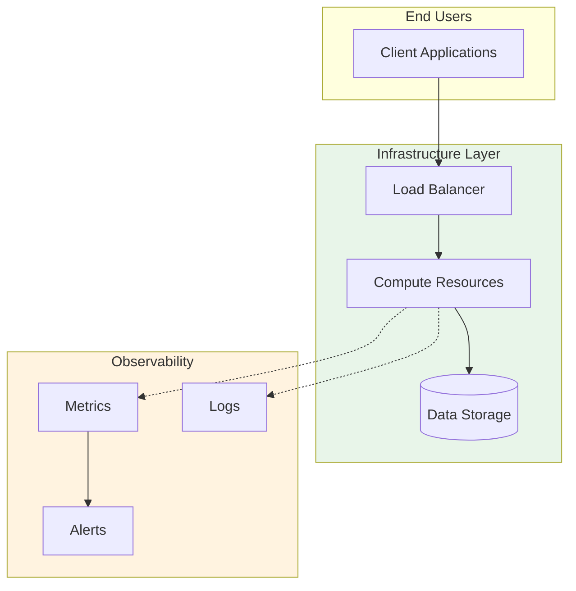

# 🔒 Zero-Trust Container Security

> **Container security platform** with Falco runtime protection, Trivy scanning, and OPA policy enforcement

## Overview
Comprehensive container security platform implementing zero-trust principles with runtime protection, vulnerability scanning, and policy-as-code enforcement.

## Use Case
Secure Kubernetes workloads with automated threat detection, image scanning, compliance enforcement, and real-time security monitoring.

## 🏗️ Architecture

### High-Level Architecture

## Tech Stack
Pulumi Go, Falco, Trivy, Open Policy Agent (OPA), Kubernetes, AWS EKS

## Key Features
- Runtime security with Falco
- Automated image scanning with Trivy
- Policy enforcement with OPA Gatekeeper
- Network policies by default
- Pod security standards
- RBAC and least privilege

**Author**: Rahul Ladumor  
**License**: MIT 2025
